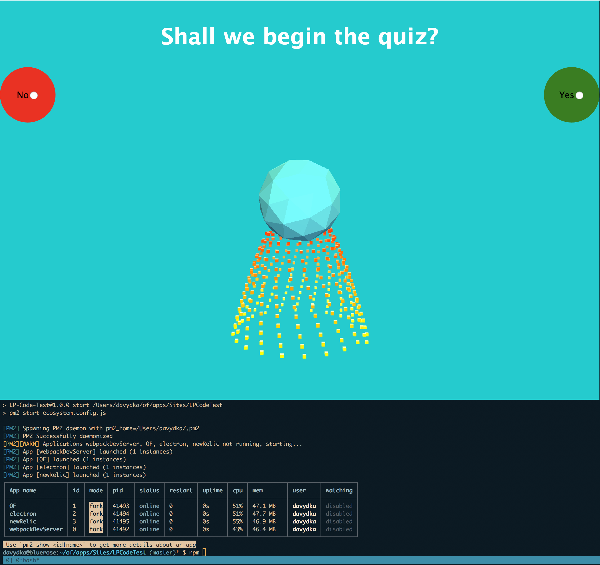
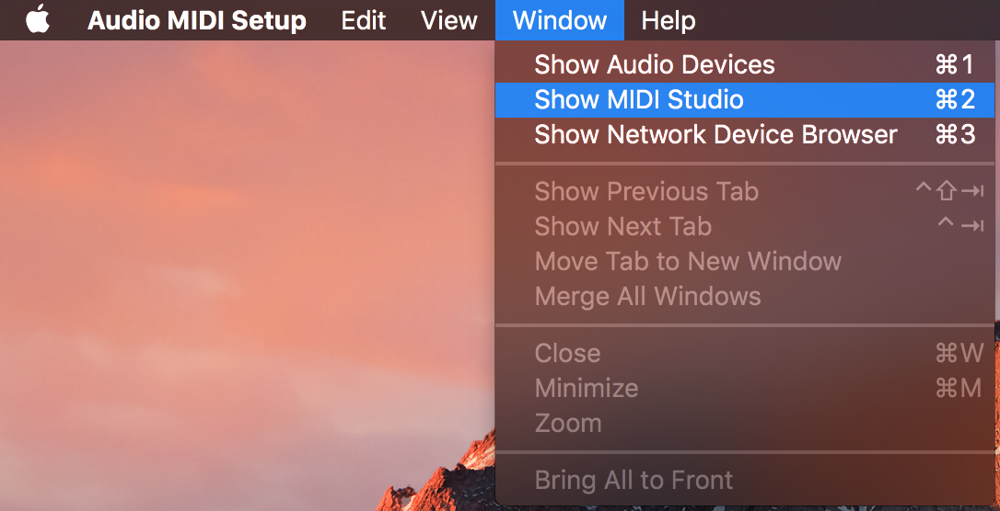
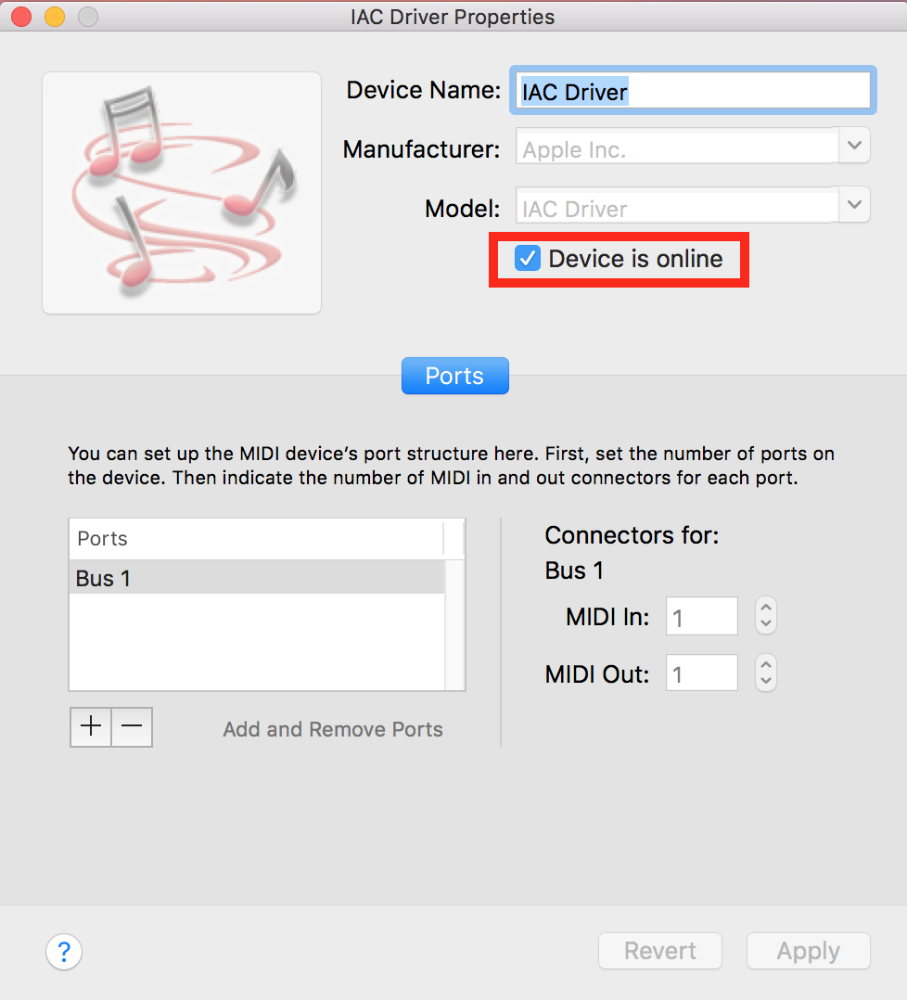

# LP Code Exercise
Developed and tested on OSX, for now. Using a variety of tools including:

* React
* Webpack
* NPM and PM2 for Process Management
* Electron
* OpenFrameworks
* Midi
* NewRelic



## Approach
The objective of this exercise is to build a questionnaire. It consists of a series of sequential questions as well as several categories. 
Each question has a yes or no answer. The UI should use a drag and drop interface and visualize the results of the user's answers. 
Each question's answer has a score/weight associated for each category.  The basic data structure is determined as follows:
```
categories: [
    { id: 0, score: 0, name: 'Income Tax'},
    { id: 1, score: 0, name: 'Public Health'},
    { id: 2, score: 0, name: 'Entrepreneurship'},
    { id: 3, score: 0, name: 'Community Art'},
    { id: 4, score: 0, name: 'Immigration'}
]

questions: [ 
    {
        id: 1,
        name: 'question1',
        text: 'Should we build more schools?',
        yes:[
            {id:0, score:5},
            {id:1, score:2},
            {id:2, score:3},
            {id:3, score:-3},
            {id:4, score:0}
        ],
        no:[
            {id:0, score:-3},
            {id:1, score:-5},
            {id:2, score:-1},
            {id:3, score:4},
            {id:4, score:0}
        ]
    }
]
```
My approach to the challenge was to focus on the front-end build-out in the following way:
1) Build a most-viable-product questionnaire using react and redux-forms. Completely un-styled.
2) Build a rich interface using Three.js and OpenFrameworks.
3) Provide build and monitoring solutions.

While I feel comfortable with monitoring and building installations, automated testing is not something I have extensive experience in. 
In the past I've worked with and large QA department that is still transitioning form manual QA to automated, but I would investigate using Jest and Puppeteer.
Puppeteer is a Chrome Headless API that I have had experience using before, and I've heard good things about Jest. It would be exciting to develop more automated testing skills.

Due to timing the back-end was also deprioritized for this exercise. In the past I've worked on projects where the client 
has already invested significant resources into a CMS such as Drupal or Laravel, for which there was a backend team providing JSON data endpoints. 
The CMS's I have the most experience in are Wordpress, Firebase, and a now defunct in-house CMS called Rubicon. Any CMS work for this exercise would be new work,
however I'm excited to develop a lightweight data-layer for these installations that can be reused more often.

### Prerequisites
* Edit `config.make` and point `OF_ROOT` to your OpenFrameworks install location.
* Install [ofxPhyllotaxis](https://github.com/edap/ofxPhyllotaxis) to your OpenFrameworks `addons` location.
* Install [ofxMidi](https://github.com/danomatika/ofxMidi) to your OpenFrameworks `addons` location.
* Have a virtual midi device to handle Electron Window to OF communication, see [Midi Setup - Mac](#midi-setup--mac)

### Getting Started
* `npm install`
* `npm run build:OF` Compile the OF application.
* `npm run monit` In a separate terminal to see processes logs.
* `npm start`
* `npm stop`
* `npm run kill` To kill pm2 daemon entirely.

### Deployments
For deployments I would use [Jenkins](https://jenkins.io/) along with [Ansible](https://www.ansible.com/) to build a deployment pipeline.
Jenkins would checkout the code, run any build instructions and tests, and then if everything passed and compiled correctly it would deploy to
each machine.

### Monitoring
PM2 provides at least 2 solutions for monitoring the application remotely. 
1) [Keymtrics](https://keymetrics.io/) is PM2's in-house solution
2) [NewRelic](https://newrelic.com/) plugin exists in the project repo to connect pm2 to newrelic.
3) Extra: It's also possible to develop an in-house solution for monitoring PM2. 

### Engagement with Users
The end result of this exercise app ended up looking like sort of a face. To further engage with users and get them coming back I would investigate
using facial detection on the user photo taken after each question to modify the look and feel of the entire app. A library such as [clmtrackr](https://github.com/auduno/clmtrackr)
could be used to read various features such how big a user's smile is, or to make a surprised expression, and then those parameters could be mapped to 
the various parameters on the screen such as color, size of elements, and their location.

### TODO / Outstanding Items
* **Back End - Create a basic and restful CRUD**
    * api - restful CRUD
    * some sort of storage/database, can use anything
        * i.e. node and sqlite
    * has admin interface
        * basic - web based
        * questions
            * adding questions
            * editing/updating questions
            * each question contains categories
                * score-to-category relationship is stored in question object
            * categories
                * adding categories
                * editing/updating categories
                * each category assigned to a question
            * admin/accounts?
            * user/participants?
            * results?
                * username/id
                * answers
                    * each answer has image

### MIDI Setup - Mac
OF and Electron need `IAC Driver Bus 1` to exist. This driver can be activated in the Audio MIDI Setup Utility (Open Spotlight and search for Audio MIDI setup).

Launch Audio MIDI Setup and select "Show MIDI Studio" from the "Window" menu.



Now double-click the IAC Driver icon and check the option "Device is online" in order to activate it.



Go [Here](https://factotumo.com/web-midi-console/) and verify that `IAC Driver Bus 1` appears as a Midi input and output. (Chrome/Electron only)
